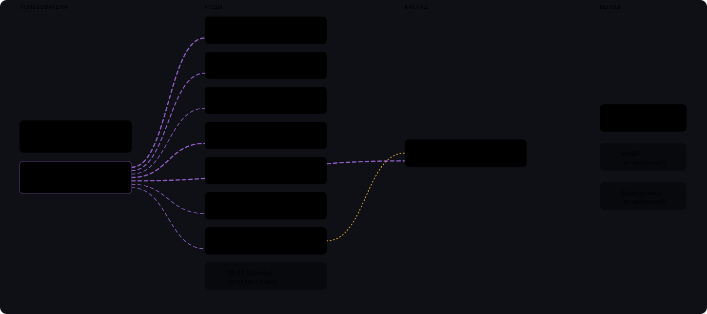

# rwa-plugin-live-flow

[](https://github.com/chudo-arky/rwa-plugin-live-flow/actions/workflows/ci.yml)
[](https://github.com/chudo-arky/rwa-plugin-live-flow/releases/latest)

[](LICENSE)

Живая схема трафика для [remnawave-admin](https://github.com/Case211/remnawave-admin):
пользователи → ноды → выходы, с реальным онлайном и VPN-скоростью из панели Remnawave.



> **English:** A read-only remnawave-admin plugin that visualizes live traffic
> from users through nodes to configured exits. It shows active users, VPN
> throughput and connection details, with separate permissions for the diagram
> and personal data. No external telemetry.
>
> Requires remnawave-admin Plugin API v1, Python 3.11+ and a single backend worker.
> Installation: download the wheel from [Releases](https://github.com/chudo-arky/rwa-plugin-live-flow/releases/latest)
> and upload it through **Administration → Plugins**.

> [!NOTE]
> Плагин работает только на чтение: не изменяет базу remnawave-admin,
> конфигурацию панели или пользователей и не использует внешнюю телеметрию.

## Возможности

- Живая схема «пользователи → ноды → выходы» с обновлением каждые 5 секунд, подгонкой под окно и масштабированием (кнопки, колесо мыши, перетаскивание).
- Реальный онлайн и VPN-скорость по счётчикам xray панели (а не по сетевой карте хоста).
- Группировка пользователей по типу сети: мобильная, Wi-Fi/LAN, неизвестная — толщина линии показывает
  число активных пользователей этой группы на ноде, бегущий пунктир — идёт трафик.
- Автоматическое отображение выходов DIRECT, BLOCK, WARP, цепочек и каскадов между нодами — по конфиг-профилям панели.
- Списки подключённых пользователей по клику на ноду или группу: логин, IP (в т. ч. IPv6), ASN, геолокация, инбаунд, нода.
- Ноды в том же порядке, что и в панели; интерфейс на русском и английском — следует за языком админки.
- Раздельные права на схему и на персональные данные.
- Только чтение, без внешней телеметрии и изменений в базе.

## Установка

### Через интерфейс админки — рекомендуется

1. Скачайте файл `.whl` из [последнего релиза](https://github.com/chudo-arky/rwa-plugin-live-flow/releases/latest).
2. Откройте **Администрирование → Плагины → Загрузить wheel**.
3. Выберите скачанный файл и перезапустите backend remnawave-admin.

При обновлении загрузите новый wheel тем же способом — админка удалит предыдущую
версию автоматически. Удаление — убрать wheel из каталога `plugins/` и перезапустить
backend: таблиц и миграций у плагина нет, после удаления в базе ничего не остаётся.

### Ручная установка

```bash
cp rwa_plugin_live_flow-*.whl /opt/remnawave-admin/plugins/
docker restart remnawave-web-backend
```

Перед ручным обновлением удалите старый wheel из каталога `plugins/`, иначе backend
может попытаться установить обе версии.

### Сборка из исходников

```bash
git clone https://github.com/chudo-arky/rwa-plugin-live-flow.git
cd rwa-plugin-live-flow
python -m pip install build
python -m build
```

Готовый wheel появится в каталоге `dist/`.

## Совместимость

| Компонент | Требование |
|---|---|
| remnawave-admin | Plugin API **v1**; страница внутри админки — с **4.5.4** (generic-маршрут `/plugins/:pluginId`); на более старых — пункт меню + standalone-страница `/api/v2/plugins/live_flow/ui` |
| Панель Remnawave | 3.x (проверено на 3.3.2); нужны `GET /api/nodes`, `GET /api/users`, `GET /api/config-profiles` под API-токеном админки |
| Python | 3.11+ |
| Backend-воркеры | один (см. «Ограничения») |

> [!IMPORTANT]
> Сейчас поддерживается один backend worker. При нескольких workers каждый
> процесс будет отдельно опрашивать панель, увеличивая нагрузку.

## Права и персональные данные

Плагин регистрирует ресурс `live_flow` с двумя действиями:

| Право | Что открывает |
|---|---|
| `live_flow:view` | схема, агрегаты, скорости, счётчики (`/data`, `/ui`, `/app`, `/ui-module`) |
| `live_flow:view_users` | списки людей: логин/email, Telegram ID, тег, IP, AS, страна/город, нода, инбаунд (`/node/{uuid}/users`, `/group/{group}/users`) |

Суперадмин получает оба права при регистрации плагина; остальным ролям `view_users`
выдавайте осознанно — без него интерфейс не предлагает клики по нодам и группам, а API
отвечает 403. Все JSON-ответы отдаются с `Cache-Control: private, no-store`.

## Откуда данные

| Что на схеме | Источник | Как часто |
|---|---|---|
| счётчик онлайна ноды | `usersOnline` панели (считает и пинги клиентов с авто-выбором серверов) | опрос панели каждые 15 с |
| реально активных | `userTraffic.onlineAt` + `lastConnectedNodeUuid` юзеров панели, окно 180 с от текущего времени | опрос панели каждые 15 с |
| скорость VPN ноды / юзера | дельты счётчиков xray панели `trafficUsedBytes` / `usedTrafficBytes` между двумя последними разными значениями | панель двигает их каждые ~30 с / ~15 с |
| тип сети юзера (мобильный / Wi-Fi-LAN) | `ip_metadata` админки по последнему IP юзера (`is_mobile`, `connection_type`) | кеш 45 с |
| IP / AS / гео в списках | `user_connections` (агент rw-admin) + `ip_metadata` админки | на открытие списка |
| форма выходов, каскады | конфиг-профили панели | кеш 60 с (при ошибке — последний удачный набор, `profiles_stale`) |
| сетевая скорость хоста (в тултипе) | `net_tx_bps` / `net_rx_bps` агента rw-admin — **весь** NIC хоста, справочно | агент, 30 с |

Если опрос панели недоступен, схема переключается на данные синка админки (лаг до 5 мин),
в шапке видно «синк БД»; при ошибке опроса показывается только её код.

**Чего плагин не знает:** сколько трафика ушло в каждую конкретную ветку выходов —
панель таких чисел не хранит, поэтому линии к выходам рисуются только туда, где есть что
измерять, а остальные блоки помечены «нет измерений». Каскад на уровне ядра (WireGuard в
обход xray) не виден вовсе.

## Ограничения

- **Один backend-worker.** Опрос панели живёт в памяти процесса; при нескольких uvicorn-воркерах
  каждый опрашивает панель сам (нагрузка ×N, данные у каждого корректные). Плагин пишет
  предупреждение в лог, если видит `WEB_CONCURRENCY`/`UVICORN_WORKERS` > 1.
- Опрос обрезается на 20 000 пользователях (срез помечается `truncated`).
- Направления ↑/↓ у VPN-скорости нет — панель отдаёт один счётчик.

История изменений — [CHANGELOG.md](CHANGELOG.md).

## Лицензия

MIT
